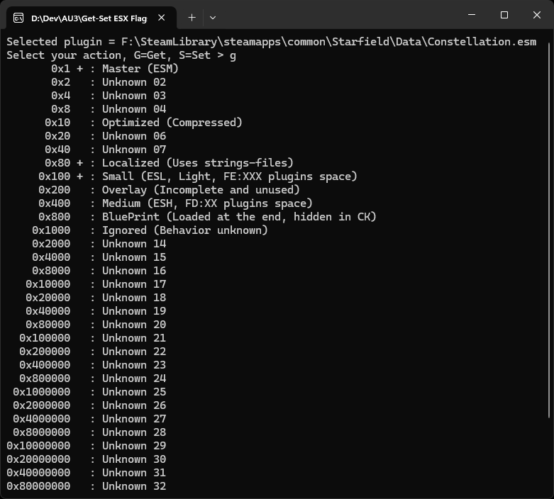

# Starfield.Get-Set.ESX.Flags

This utility allows you to set any Starfield plugin flag like Master, Small, Medium and even Unknown XX.

Launch the utility and select your plugin.

## Get

Use singe 'g' command to print all plugin flags.

## Set

Use 's (flag) (1/0)' command to set flag's value.
+ s 0x100 1 // will add 'Small' flag
+ s 0x400 0 // will remove 'Medium' flag

Backup is saved on any change: PluginName.esm ➔ PluginName.esm.YYYY-MM-DD-HH-MM-SS

## Ini

All flags info is stored in ini-file but no such file provided in release, you download this file if it's not present in the utility root.

URL file provided in release points to any plain text web resource that will be used as flags info holder.

You can remove the default file and create your own instead, this means custom definitions are supported.

This repo has 2 related files:
+ [Starfield](./Source./GS-ESX-Flags.Starfield.ini) is default.
+ [Skyrim SE](./Source./GS-ESX-Flags.SkyrimSE.ini) can be switched to.
